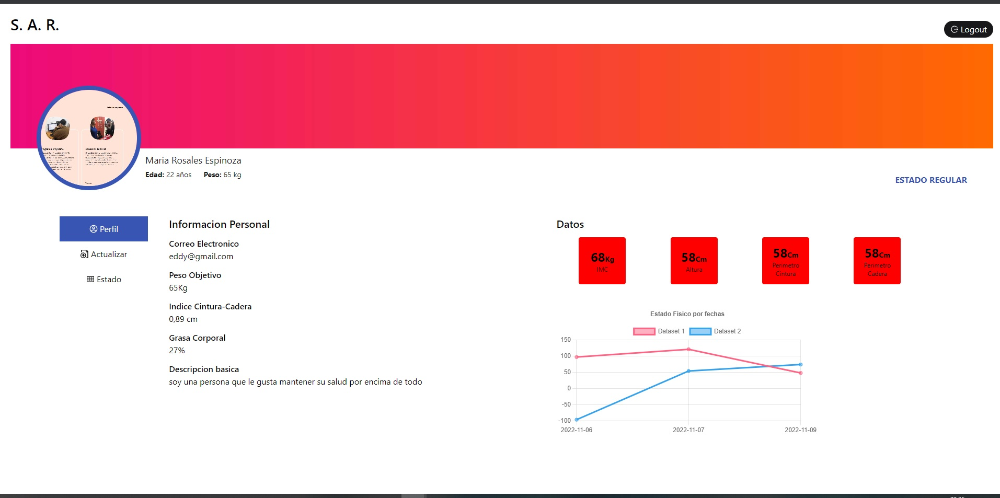

# Sistema de Alto rendimiento

parte de las vistas para el sistema de alto rendimiento

---

para poder utilizar la aplicacion por parte del frontend instale las dependencias necesarias

> npm install || npm i

y para poder visualizar las pantallas utilize el siguiente comando:

> npm run dev
